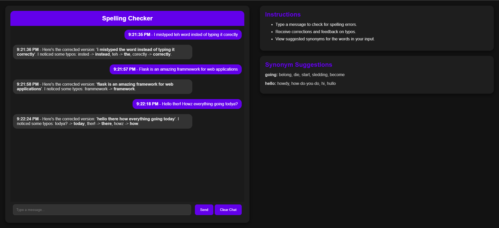

# Spelling Checker Chatbot 🚀

A **Flask-based web application** designed as a spelling checker chatbot. It analyses user messages for spelling errors, corrects them, and provides up to five synonym suggestions for each word to improve vocabulary and comprehension. This application features a visually appealing, responsive, and interactive user interface built with **HTML**, **CSS**, and **JavaScript**.

> Below is an example of the chatbot correcting spelling issues and suggesting synonyms:



---

## ✨ Features

- **Spelling Correction:** Detects and corrects misspelled words in user input.
- **Synonym Suggestions:** Suggests up to five synonyms for any misspelt or inputted word to enhance vocabulary.
- **Interactive Chat UI:** User-friendly, intuitive, and mobile-responsive interface for better usability.
- **Real-Time Feedback:** Provides instant spelling corrections and synonym feedback.

---

## 📂 Folder Structure

Below is the recommended and organised folder structure of the project. Each folder and file is explained for better clarity:

```
Spellchecker Chatbot/
│
├── assets/                 # Folder for storing static visual assets like example images
│   ├── Chatbot_example.PNG  # Example image showcasing the chatbot's capabilities
│
├── static/                 # Folder for static frontend resources (CSS & JavaScript)
│   ├── styles.css         # CSS styles for application UI/UX design
│   ├── scripts.js         # JavaScript scripts managing frontend interactivity
│
├── templates/              # HTML templates that define the user interface
│   ├── index.html         # Main HTML file for the chatbot's frontend
│
├── app.py                  # Main Flask application entry point
└──
```

---

## 🛠️ Installation

Follow these simple steps to set up the application:

### 1. Clone the Repository
Start by cloning the repository to your local machine:
```bash
git clone https://github.com/Ruhul127/Spellchecker-Chatbot.git
cd Spellchecker-Chatbot
```

---

### 2. Set Up a Virtual Environment
A virtual environment isolates dependencies for this project. Execute the following commands:
```bash
python -m venv venv
source venv/bin/activate  # On Windows use: venv\Scripts\activate
```

---

### 3. Install Required Dependencies
Use `pip` to install all necessary dependencies listed in `requirements.txt`:
```bash
pip install -r requirements.txt
```

---

### 4. Download Necessary NLTK Data
The chatbot relies on specific NLTK datasets for synonym suggestions. Run this in Python:
```python
import nltk
nltk.download('wordnet')
nltk.download('omw-1.4')
```

---

### 5. Run the Application
Start the server to access the chatbot:
```bash
python app.py
```

---

### 6. Access the Application
Open a web browser and visit:
```
http://127.0.0.1:5000
```

---

## 💬 Usage Instructions

1. **Type your message** in the chatbot's input field.
2. Click the **Send** button to analyse your text for spelling mistakes and receive synonym suggestions.
3. Corrected messages and suggestions will be shown in the chat window.

---

## 📄 Additional Notes

- Ensure your virtual environment is activated before running the application.
- The chatbot relies on Flask for backend logic and NLTK's WordNet for synonym analysis.

---
